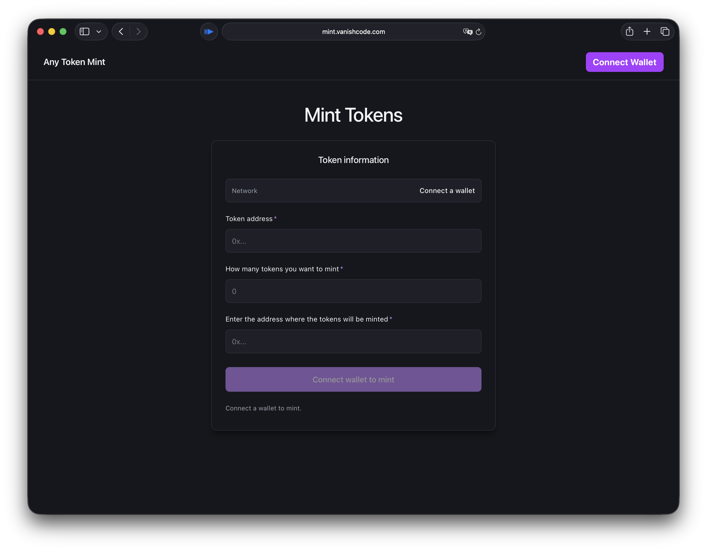

# Any Token Mint — mint any ERC20 token on any EVM testnet

A free, wallet-connected dApp for minting any ERC20 token on any EVM
**testnet** — Sepolia, Holesky, Base Sepolia, Arbitrum Sepolia, Optimism
Sepolia, Polygon Amoy, zkSync Sepolia, Linea Sepolia, Scroll Sepolia, Mantle
Sepolia, Blast Sepolia, BNB testnet, Avalanche Fuji and every other chain
exported by `wagmi/chains` (mainnets too, if you happen to hold the minter
role on a token).

Connect a wallet, paste a token contract address, an amount and a recipient —
the app reads `decimals()`, simulates `mint(address,uint256)` so revert
reasons surface before signing, then submits the transaction.

> Live: <https://mint.vanishcode.com>

**Keywords:** mint testnet token · sepolia mint · holesky mint · base sepolia
mint · arbitrum sepolia mint · polygon amoy mint · ERC20 mint dApp · testnet
faucet alternative



## Stack

- **Vite 8** + **React 19** + **TypeScript 6**
- **wagmi v2** + **viem** + **RainbowKit** for wallet + chain plumbing
- **Biome** for lint + format, **Lefthook** for git hooks
- **pnpm** for package management

Every chain exported by `wagmi/chains` is registered, so the form follows
whatever network the connected wallet switches to. There is no in-app network
selector by design.

## Getting started

```bash
# 1. configure WalletConnect — get a project ID at https://cloud.reown.com
cp .env.example .env
# then fill in VITE_WC_PROJECT_ID

# 2. install + run
pnpm install
pnpm dev
```

## Scripts

| Command          | What it does                                           |
| ---------------- | ------------------------------------------------------ |
| `pnpm dev`       | Vite dev server with HMR                               |
| `pnpm build`     | `tsc -b` (project references) then `vite build`        |
| `pnpm preview`   | Serve the production build locally                     |
| `pnpm lint`      | `biome check .`                                        |
| `pnpm format`    | `biome format --write .`                               |
| `pnpm typecheck` | `tsc -b --noEmit`                                      |

`pnpm install` also installs Lefthook hooks (pre-commit runs Biome on staged
files plus a project-wide `tsc --noEmit`).

## How it works

1. `useAccount()` exposes the connected wallet's `address`, `chain`, and `chainId`.
2. When the user enters a token address, `useReadContract` fetches `decimals()`
   and `symbol()` from that contract on the current chain.
3. Amount input is converted to base units with `parseUnits(amount, decimals)`.
4. `useSimulateContract` runs a dry call against `mint(to, amount)`. Revert
   reasons (e.g. *caller is not the minter*, *function does not exist*) surface
   in the hint line below the submit button before any transaction is signed.
5. On submit, the simulated request is handed to `useWriteContract`, then
   `useWaitForTransactionReceipt` watches the hash to confirmation.

The hint line under the **Mint Tokens** button is always populated when the
button is disabled — it tells the user exactly which precondition is missing
("Reading token info…", "Could not read token on Polygon — make sure the
address is an ERC20 deployed on this network", etc.).

## Notes

- Mainnet reads are routed through a fallback of
  `publicnode.com → cloudflare-eth.com → rpc.ankr.com` because viem's default
  `eth.merkle.io` endpoint is unreliable. Other chains use viem defaults; if
  you hit RPC errors on a specific chain, add it to the `transports` map in
  [`src/wagmi.ts`](./src/wagmi.ts).
- `mint(address,uint256)` is one of several common mint signatures. Tokens that
  expose a different signature (e.g. `mint(uint256)` for the caller, or
  `mintTo(...)`) won't work without editing `ERC20_ABI` in
  [`src/App.tsx`](./src/App.tsx).
